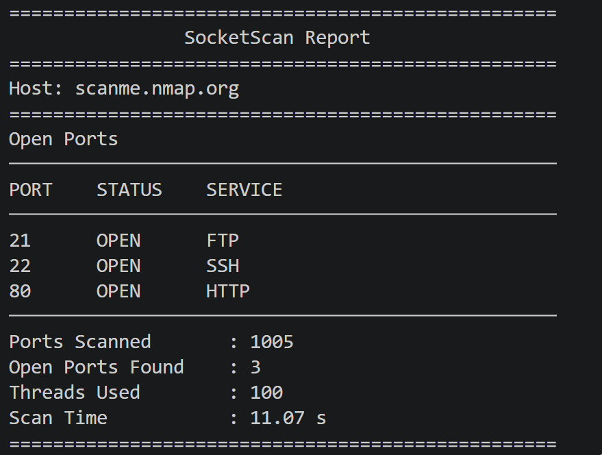

# SocketScan - TCP Port Scanner

A lightweight TCP port scanner written in Python using the socket module. It supports configurable host and port ranges, service detection, and a clean command-line interface.

## Disclaimer

This project was developed for educational purposes to learn Python socket programming and networking concepts. Only scan hosts and networks that you own or have explicit permission to test.

## Features

- Multithreaded TCP port scanning
- Automatic hostname validation
- Service detection for common ports
- Structured scan reports
- Thread pool using `ThreadPoolExecutor`
- Scan timing and performance metrics
- Clean, formatted CLI output

## Changelog

### v1.1.0 - Multithreaded Scanner Release
#### Added
- Multithreaded port scanning using `ThreadPoolExecutor`
- Structured `scan_data` object for storing scan results
- Detailed CLI report displaying:
  - Host
  - Open ports
  - Port status
  - Service names
  - Total ports scanned
  - Thread count
  - Scan duration
- Thread usage statistics
- Improved report formatting with aligned output

#### Changed
- Refactored `scan_port()` to return structured dictionaries
- Refactored `scan_ports()` to return a unified `scan_data` object
- Replaced `print_summary()` with `print_report()`
- Moved scan timing into `scan_ports()`
- Simplified `main()` by separating scanning and reporting responsibilities

#### Improved
- Better separation of concerns throughout the project
- Cleaner, more modular architecture
- Improved readability and maintainability
- More professional terminal output

## Technologies Used

- Python 3
- socket
- concurrent.futures
- time

## Installation

Clone the repository:

```bash
git clone https://github.com/rohannayak032/SocketScan.git
```

Run:

```bash
python socketscan.py
```

## Example Output

Example scan of `scanme.nmap.org` using SocketScan v1.1.0.

<p align="center">
  
</p>

## Author

Built by Rohan Nayak as a cybersecurity learning project.